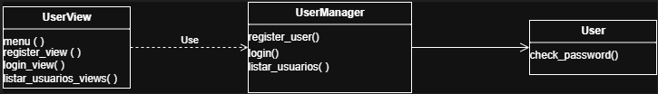
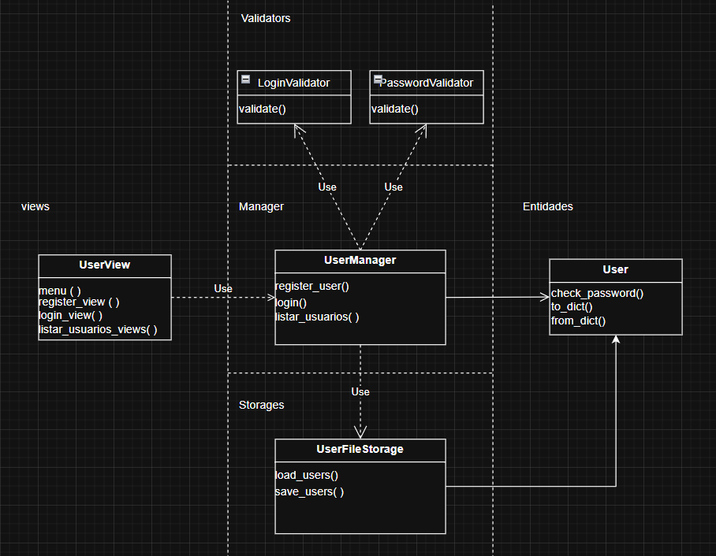

# metodos-UFPB
 Trabalho de Metodos de Projeto de Software

 Neste trabalho, implementaremos um sistema de apoio a idosos com Alzheimer, como forma de tardamento das perdas cognitivas dos usuários.

 A aplicação visa, com o acompanhamento da Inteligência Artificial, criar um caminho de jogos para os níveis de perdas cognitivas diversas. Tal que, o usuário receba um jogo de próxima fase, com base no seu desempenho na anterior, tendo em vista tardar a perca da memória.

 Para o desenvolvimento do projeto, a equipe escolhe o desenvolvimento web com a linguagem python com o framework Flask.

 Sprints:

 Sprint 1 - Desenvolvimento do Diagrama de Classes e Implementação inicial do caso de uso de gerenciar usuário.

 -Imagem 1 - Diagrama UML -

 

 -Imagem 2 - Diagrama de Classes - 

 

 Sprint 2 - Atualização do Diagrama de Classes e Implementação de validação para login e senha e persistência de dados com arquivo JSON.

-Imagem 3 - Diagrama de Classes -

